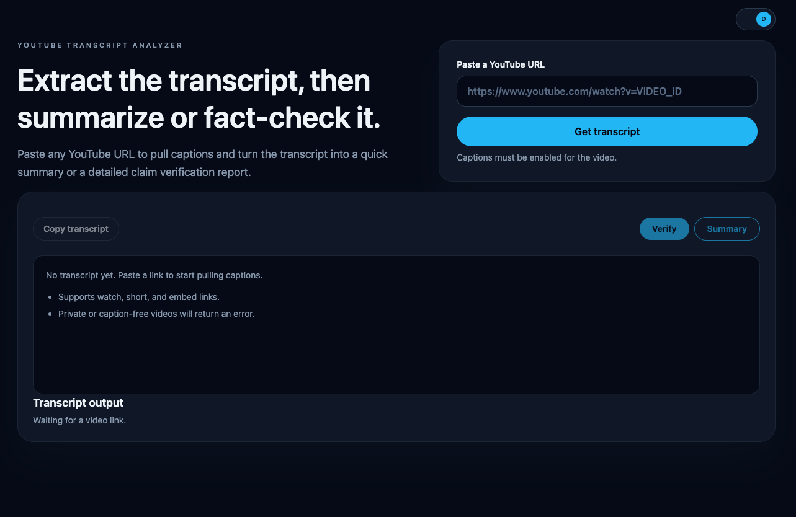

# YouTube Factcheck 🎥✅



---

A SvelteKit app that:

- 📜 extracts a YouTube transcript from a video URL,
- 📋 lets you copy/read the raw transcript,
- 🤖 streams an AI-generated fact-check report or summary for that transcript.

## 🧰 Requirements

- Node.js 20+ recommended
- npm/yarn/pnpm
- A valid Google AI API key for Gemini

## ⚙️ Setup

1. Install dependencies:

```bash
npm install
```

2. Create `.env` (or `.env.local`) with at least:

```bash
GOOGLE_AI_API_KEY="your_key_here"
```

You can generate a Google Gemini API key here: [https://aistudio.google.com/app/apikey](https://aistudio.google.com/app/apikey).

Optional variables:

```bash
# Model/config
GOOGLE_AI_MODEL="gemini-2.5-flash"
ENABLE_SHORT_VERIFICATION="true"
TRANSCRIPT_DEBUG="false"
```

Possible `GOOGLE_AI_MODEL` values:

- `gemini-2.5-flash` (default)
- `gemini-2.5-pro`
- `gemini-2.0-flash`
- `gemini-2.0-flash-lite`
- `gemini-1.5-flash`
- `gemini-1.5-pro`

## ▶️ Run Locally

```bash
npm run dev
```

Open the app at `http://localhost:5173`.

## 🔁 Proxy Rotation & Proxy Warm (WIP)

```bash
# Warm-proxy endpoint auth and script URL
PROXY_WARM_SECRET=""
PROXY_WARM_URL="http://localhost:5173/api/warm-proxy"
PROXY_WARM_WRITE_LIST="false"

# Proxy rotation cache behavior (used by /api/warm-proxy)
PROXY_ROTATION_CACHE_PERIOD="10"
PROXY_ROTATION_MAX_PROXIES="20"
PROXY_ROTATION_CACHE_DIR=""
PROXY_LIST_WRITE_ENABLED="false"
```

## 🧱 Stack

- SvelteKit 2 + Svelte 5
- Vite 7
- Tailwind CSS 4
- `@google/generative-ai` (Gemini API)
- Local transcript/proxy libraries under `src/lib/`
- Netlify adapter (`@sveltejs/adapter-netlify`)

## 🔍 How It Works

1. User pastes a YouTube URL and submits.
2. Server extracts video ID from supported URL formats (`watch`, `youtu.be`, `shorts`, `embed`, `live`).
3. Transcript fetcher requests YouTube watch/innertube endpoints and parses caption tracks/snippets.
4. Transcript text is shown in the UI and can be copied.
5. User clicks `Verify` or `Summary`.
6. The selected API route streams AI output over `text/event-stream`.
7. UI renders the streamed Markdown safely.
8. Completed reports are saved in browser `localStorage` and can be reopened on `/history`.

## 📜 Scripts

- `npm run dev`: start dev server
- `npm run build`: production build
- `npm run preview`: preview build locally
- `npm run check`: typecheck + lint
- `npm run lint`: lint + prettier check
- `npm run format`: prettier write
- `npm run proxy:warm`: call `/api/warm-proxy`
- `npm run proxy:generate`: call `/api/warm-proxy?writeList=true`

## 🌐 API Endpoints

### ✅ `POST /api/verify`

- Body: `{ "transcript": "..." }`
- Response: `text/event-stream` with `data: {"text":"..."}` chunks
- Purpose: fact-check style report from transcript text

### 📝 `POST /api/summary`

- Body: `{ "transcript": "..." }`
- Response: `text/event-stream` with `data: {"text":"..."}` chunks
- Purpose: concise summary report from transcript text

### 🔥 `GET|POST /api/warm-proxy`

- Optional auth header: `Authorization: Bearer <PROXY_WARM_SECRET>`
- Optional query: `?writeList=true` (writes proxy list only when allowed)
- Purpose: refresh proxy cache for rotation subsystem

## 🚀 Netlify Deployment Notes

- Project uses `@sveltejs/adapter-netlify` in `svelte.config.js`.
- `netlify.toml` enables a local plugin at `netlify/plugins/warm-proxy`.
- On successful deploy, plugin tries to call `/api/warm-proxy` on:
  - `PROXY_WARM_URL`, or
  - `DEPLOY_PRIME_URL`, or
  - `URL`.

## 🧭 Usage

1. Start the app with `npm run dev`.
2. Paste a YouTube video URL into the form.
3. Click `Get transcript`.
4. Click `Verify` for fact-check output or `Summary` for condensed output.
5. Review streamed results in the modal dialog.
6. Click `History` to revisit previous reports saved in your browser.

## ⚠️ Important Limitations

- Transcript extraction only works when captions exist and are retrievable.
- Some videos fail due to age restrictions, region restrictions, or YouTube anti-bot/IP blocking.
- AI output can be wrong or incomplete; treat it as assistance, not final truth.

## 🔒 Security

- Keep `.env` secrets out of version control.
- Do not expose `GOOGLE_AI_API_KEY` in client-side code.
